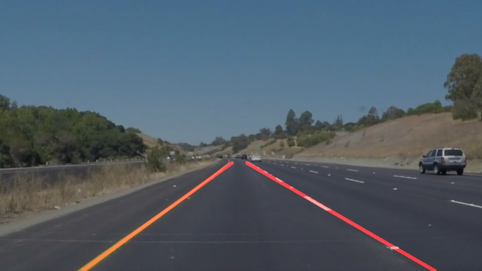
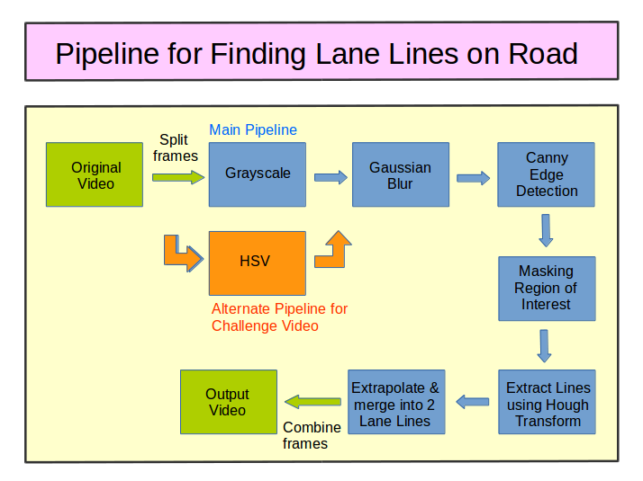

# **Finding Lane Lines on the Road** 

## Writeup

---

**Finding Lane Lines on the Road**

The goals / steps of this project are the following:
* Make a pipeline that finds lane lines on the road
* Reflect on your work in a written report

---

## Reflection

### 1. Describe your pipeline. As part of the description, explain how you modified the draw_lines() function.

I have created two pipelines - one base pipeline for the two main videos, and an alternate pipeline for the challenge video. These two pipelines differ only in the first step. The rest of the steps remain the same, except for the threshold values and parameters that were tweaked for the challenge videos. The pipeline is as follows:

1. The images are converted to grayscale. For the challenge video, an alternate pipeline using conversion to HSV is created and used. 

2. The grayscale images are smoothened with Gaussian Blur.

3. The edges of the smoothened images are detected using Canny Edge Detector.

4. Areas in the image other than the region of interest are masked out.
  a. This is done using fillPoly on a trapezoidal region of interest roughly in the lower half of the image. 
  b. A bitwise_and operator is used to apply the mask to the original image.

5. The relevant lines are extracted from the canny edge detected image using Hough transform.  

6. The set of lines extracted in step 5 is sent to the draw_lines() function to plot and overlay the lane lines on the image.     a. In order to obtain a single line on the left and right lanes, the draw_lines() function is modified to split the lines into 2 groups based on the slope(m) values.  
  b. The average of these two groups are used to construct the two lane lines. 
  c. Slope value thresholds are given to avoid considering horizontal lines that are implausible lane lines as well as to avoid NaN errors due to vertical lines.
  d. There is a comment in this function which can be uncommented to show the initial set of lines from hough tranform in green.

Here is how the pipeline looks like: 

### 2. Identify potential shortcomings with your current pipeline

The base pipeline **cannot detect the lane lines under all lighting conditions**, such as when the contrast is low, or when the lighting is too bright or too dark, etc. That is the reason for which I included an alternative pipeline using HSV conversion before edge detection to detect lines based on colour hue, saturation and value. But due to my limited knowledge of colour spaces, I have just input values that I found to be performing good based on trial and error on the test images and the challenge video.

A second problem, common for both the pipelines, is the **inability to detect extremely vertical or horizontal lane lines**. This is due to the default threshold values given for extracting the lines from set of lines provided by the hough transforms. 
*Reason for using threshold values:* Low values of slope are screened out to avoid detecting defects on the road or the bonnet of the car falselly as lane lines. High values of slope may cause numerical errors throwing out NaNs.

Another potential shortcoming could be detecting road ends, fences, other lane lines, bonnet of the car, surrounding vehicles and objects, marks and defects on the road, shadows, etc. **falsely** as lane lines.

### 3. Suggest possible improvements to your pipeline

A possible improvement would be to combine the edges obtained from grayscale image based edge detection and hsv image based edge detection.

Another potential improvement could be to weight the lines for averaging based on certain confidence giving parameters of the line such as its length, slope, location, strength of gradients or closeness to the previous frame of the video.
